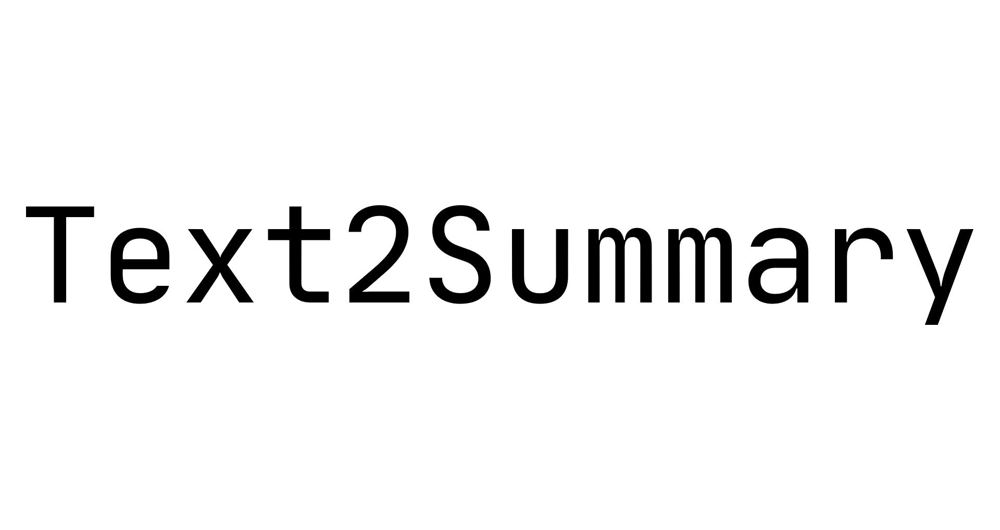

# Text2Summary API



[](https://jitpack.io/#shubham0204/Text2Summary-Android)

Text2Summary API uses on-device methods to perform text summarization on Android applications. It uses extractive text summarization 
to give you the most important sentences from a given text.

You may [read the story of Text2Summary on Medium](https://medium.com/@equipintelligence/introducing-text2summary-text-summarization-on-android-674b62419019).

* [Installation](#installation)
* [Usage](#usage)
* [More on Text2Summary](#more-on-text2summary)
* [Contribute](#contribute)

## Installation

First, we need to add the JitPack Maven repository to the root-level `build.gradle` file,

```
allprojects {
    repositories {
        // Other dependencies
        maven { url 'https://jitpack.io' }
    }
}
```

Then in the module-level `build.gradle` file, add the Text2Summary dependency,

```
dependencies {
    // Other dependencies
    implementation 'com.github.shubham0204:Text2Summary-Android:alpha-02'
}
```

## Usage

The text which needs to be summarized has to be a `String` object. Then,
use `Text2Summary.summarize()` method to generate the summary.

```kotlin

var summary = Text2Summary.summarize( someLongText , compressionRate = 0.7 )

```
The number `0.7` is referred as the compression factor. Meaning, given a text of 10 sentences, a summary of 7 sentences will be
produced. This number must lie in the interval `( 0 , 1 ]`.

You may extract text from a file and then pass it to Text2Summary,

```kotlin

val bufferedReader: BufferedReader = File( "poems.txt" ).bufferedReader()
val text = bufferedReader.use{ it.readText() }
val summary = Text2Summary.summarize( text , 0.7 )

```

### Using Text2Summary for huge texts

As heavy operations are performed for the summarization, a huge text given to Text2Summary may block the `Activity` UI thread.  
To counter this, use `Text2Summary.summarizeAsync()`,

```kotlin
val callback = object : Text2Summary.SummaryCallback {
    override fun onSummaryProduced(summary: String) {
        // The summary is ready!
    }
}
Text2Summary.summarizeAsync( someLongText , 0.7f , callback  )
```

The `summarizeAsync()` method internally calls the `summarize()` method itself wrapped in a `AsyncTask`.

## More on Text2Summary

Text2Summary uses the TF-IDF for extractive text summarization. Note, this is not abstractive text summarization which
use neural networks like the Seq2Seq model. As TensorFlow Lite does not support fully the conversion of `Embedding` and `LSTM`
layers, we need to use the above mentioned algorithms.

1. The `text` which is given to `TextSummary.summarize()` is broken down into sentences. These sentences are further brought down
to words ( tokens ).
2. Using TF-IDF algorithm, a TF-IDF score is calculated for each word.
3. Next, we take the sum of such scores for all words present in the sentence.
4. Finally, we take the top N highest scores. The corresponding sentences hold most of the information present in the text. These
sentences are then concatenated and returned as the summary.

## Contribute

If you are facing any issues, [open an issue](https://github.com/shubham0204/Text2Summary/issues) on the repository. You may
send your suggestion at equipintelligence@gmail.com.


